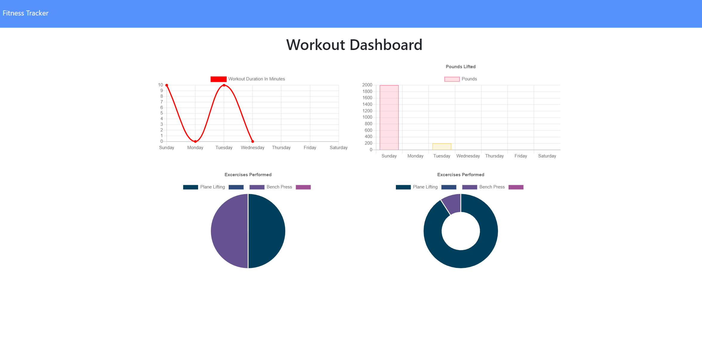

## Title

Workout Tracker App

## Description

This project is an app to track a user's workouts over the course of a week. They can input the type, name, duration, distance, weight and any other workout variable, and their workouts will be charted on the 'stats' page.

## Screenshot

## Table of Contents :

[Title](#Title),
[Description](#Description),
[Usage](#Usage),
[License](#License),
[Contributors](#Contributors),
[Test](#Test),
[Questions](#Questions)

## Usage

Educational.

## License

This project is licensed under the MIT license.

## Contributors

Lauren Noeltner

## Test

Use this command to initiate the program: "npm start"

## Questions

You can ask questions at: https://www.github.com/LNoeltner1
