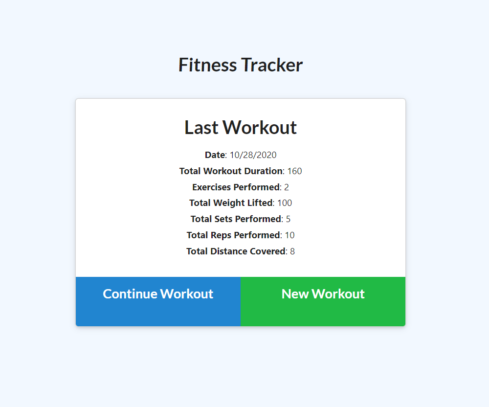

## Title

Workout Tracker App

## Link

[Workout Tracker App](https://workout-tracker-3.herokuapp.com/)

## Description

This project is an app for a user who wants to track their workouts online. When they arrive on the page, they will see all of their workout information for the current day.

When the user click 'New Workout', they will be initially prompted to choose between the Cardio and Resistance categories. When they pick the category of workout, more options will appear, always including at least a name the user can customize and the duration of the exercise.

Once the user inputs the workout variable, their workouts will be visualized in graph and chart form on the 'stats' page. Even if the user leaves the app and returns later, their data will persist.

## Table of Contents :

[Title](#Title),

[Link to App](#Link),

[Description](#Description),

[License](#License),

[Contributors](#Contributors),

[Questions](#Questions)

## License

This project is licensed under the MIT license. It may be used for educational or personal use only.

## Contributors

Lauren Noeltner

## Questions

You can ask questions at: https://www.github.com/LNoeltner1
